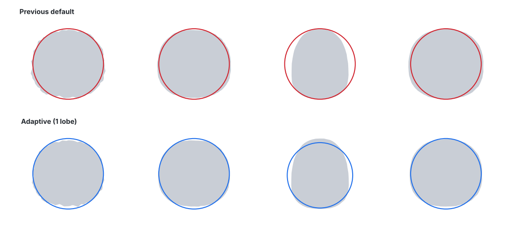
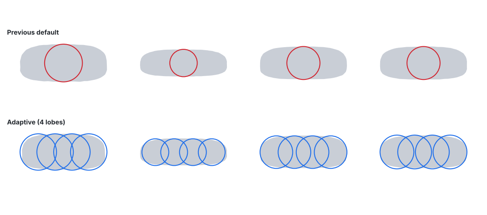
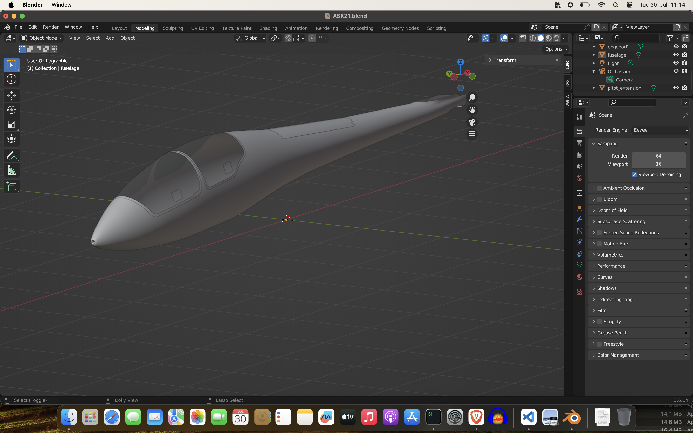

# PipeGuide
"Mastering the art of cylindrical flight models, one pipe at a time."

**PipeGuide** turns a 3D fuselage model into YASim `<fuselage>` pipes. YASim only understands round, tapered pipes, so PipeGuide works out how many to use, where they start and end, and how big they are, so that they follow your model without chasing noise or smoothing away real features.



*Round sections: the adaptive pipes are sized to each section's area, using 8 pipes instead of 62.*



*Wide sections: one round pipe cannot represent them, so PipeGuide spreads overlapping pipes across the section (4 lobes here, 20 pipes).*

These figures come from synthetic test bodies. Regenerate them, or plot your own model, with `python3 docs/make_figures.py [model]`.

## Install

```bash
git clone https://github.com/MrChillStorm/PipeGuide.git
cd PipeGuide
pip3 install lxml numpy pyvista scipy
```

## Usage

```bash
python3 pipeguide.py fuselage.stl -o fuselage.xml
```

The input must be a closed mesh (OBJ, STL or PLY) in the FlightGear axes: **+x forwards, +y left, +z up**. The output is a block of `<fuselage>` elements to paste into your YASim file, and the run prints how well it matches (output from the wide synthetic body):

```
Fitted 20 pipes (5 sections x up to 4 lobes, section limit 63), RMS error 1.21% of local radius.
Versus the model: 3.7% under-fit, 5.0% over-fit, 91.7% overlap.
Balanced choice: 4 lobe(s), shape mismatch 8.8%, FDM distortion 1.69 (drag shifted 68%, mass shifted 69%, mass x1.38).
Airflow geometry vs model: volume +1.0%, max section -0.6%, side area +1.3%, plan area -0.2%, wetted area +6.2%.
YASim will see: 52 surfaces, 40 ground-contact points.
Overlapping pipes are summed by YASim: drag weight x2.36, mass weight x1.38 ... (and the cx/cy/cz factor to compensate)
XML written with 20 sections.
```

### Options

| Option | Default | Meaning |
|---|---|---|
| `-o`, `--output-file` | `yasim.xml` | Output file |
| `-s`, `--sections` | 63 | Maximum sections per chain |
| `--lobes` | `auto` | `auto` searches for the best layout. `1` is one round pipe per section, `N` spreads N overlapping pipes across the wider direction |
| `--pipe-cost` | 0.002 | `auto`: price of each pipe (higher = fewer pipes) |
| `--aero-weight` | 1.0 | `auto`: weight of the error in drag-governing geometry |
| `--fdm-weight` | 0.1 | `auto`: weight of the distortion overlapping pipes cause in YASim (0 ignores it) |
| `-t`, `--tolerance` | 0.01 | `--lobes 1`/`N`: RMS error as a fraction of local radius (0 = always use `--sections`) |
| `-b`, `--bias` | 0 | -1 to 1. 0 balances over- and under-fit; positive favours pipes that contain the model |
| `--fit` | `area` | What a round pipe matches: `area`, `perimeter` or `enclosing` |
| `--legacy` | | The original fixed-section Bessel pipeline. Implied by `-d` and `-x` |
| `-d`, `-x`, `-f`, `-c` | | Legacy dual-axis, diagonal-axis, filter order and filter cutoff |

## How it works

1. **Cross-sections** are cut from the mesh exactly, along hundreds of stations, using the outer skin only.
2. **Pipe boundaries** are placed by dynamic programming where the shape actually changes (canopy, wing root, tail boom), not at equal spacing. The pipe count is the smallest that meets the tolerance, and never asks for accuracy below the mesh's own noise.
3. **Lobes**: where a section is not round, a row of equal overlapping pipes is fitted across it. Lobes that would duplicate a neighbour are pruned, so round parts stay a single pipe.
4. **`--lobes auto`** tries lobe counts and tolerances and picks the lowest of

   `J = (under-fit + over-fit) + aero_weight * airflow geometry error + fdm_weight * FDM distortion + pipe_cost * pipes`

   - *Under/over-fit* are fractions of model volume, measured against the real cross-sections.
   - *Airflow geometry error* is the RMS relative error of volume, maximum cross-section, side and plan projected area and wetted area against the mesh. It says how faithful the geometry is. It cannot give force values: those depend on YASim's `cx`/`cy`/`cz`, which need flight or CFD data to calibrate.
   - *FDM distortion* compares YASim's view of the pipes with one area-matched pipe per section (see below). A uniform drag change is not counted, since scaling `cx`/`cy`/`cz` undoes it; where the drag and mass sit along the body is.

On the synthetic wide, flat body, one pipe per section was +75% off in side area and -35% in plan area; the chosen lobes bring both to within about 2%.

## What YASim does with the pipes

From `Airplane::compileFuselage` in the FlightGear source:

- Every pipe is processed independently. **Overlap is not handled**, so overlapping pipes are summed.
- Each pipe is cut into `ceil(length / width)` segments. A segment's drag weight is its local width times its share of the length, so drag scales with **width, not cross-section area**. Mass weight is that to the power 1.5.
- Both ends of every pipe become ground-contact points.
- Tapered pipes (`midpoint` 0 or 1, as PipeGuide writes them) are only read correctly by **YASim version 32 or newer**. Set `version="YASIM_VERSION_32"` or later on the airplane.

When lobes are used, PipeGuide prints how much they inflate YASim's drag and mass weights and the factor to apply to `cx`, `cy` and `cz` to keep the single-pipe drag budget.

## Preparing your model



1. **Clean it**: remove wings, stabilizers, landing gear and anything else that is not fuselage.
2. **Align it** to the FlightGear axes above (rotate in Blender, Maya or 3ds Max). OBJ files are assumed to be Y-up and are rotated 90 degrees about x on load.
3. **Close it**: the mesh should be watertight, and scaled the way your flight model expects. PipeGuide does not rescale.

## Legacy modes

`--legacy` runs the original pipeline: a fixed number of equal sections, smoothed with a Bessel filter. `-d` (split upper/lower and left/right) and `-x` (rotate 45 degrees first) build overlapping multi-pipe layouts the same way; run both and merge the output by hand for more detail. They are kept for compatibility, and the adaptive default is usually a better start.

## Development

```bash
pip3 install pytest matplotlib
python3 -m pytest tests
```

`pipefit.py` holds the fitting engine (numpy only); `tests/synthetic.py` builds the test bodies.

## Contributing

Suggestions, issues and pull requests are welcome.

## License

GPL 2.0. See [LICENSE](LICENSE).
