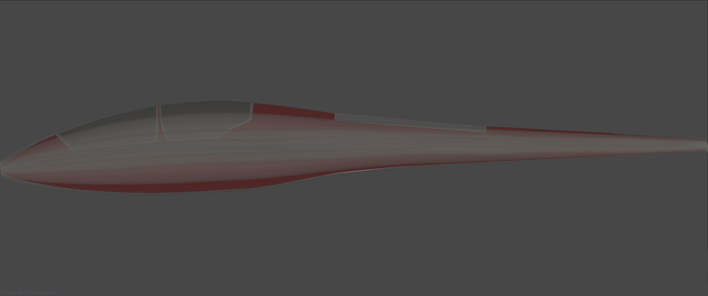
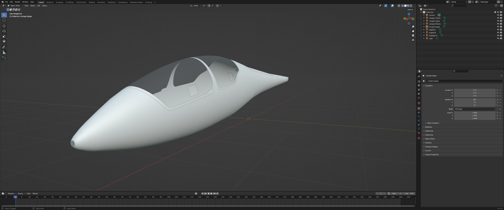

# PipeGuide
"Mastering the art of cylindrical flight models, one pipe at a time."

**PipeGuide** is a powerful tool designed to assist FlightGear and YASim developers in transforming 3D aircraft fuselage models into YASim-compatible fuselage sections. While YASim requires fuselages to be represented as simple cylindrical shapes, aircraft fuselages are rarely perfect cylinders. **PipeGuide** addresses this discrepancy by refining these cylindrical representations to produce realistic and aerodynamic fuselage profiles.

## Overview

The challenge of flight model development often involves adapting detailed 3D aircraft designs to the simplified cylindrical shapes required by YASim. **PipeGuide** helps bridge this gap by dividing your fuselage model into up to four distinct sections, with advanced options for dynamic adjustments. This segmentation allows the tool to more accurately follow the aircraft’s original dimensions and shape.

The output generated by **PipeGuide** includes a refined cylindrical fuselage model that can be integrated into an existing YASim flight model. This tool automates the process of aligning, tapering, and smoothing these cylindrical sections, making it easier for developers to create accurate and functional flight models.


*Figure 1: Visualization of the ASK 21 glider's YASim flight model, where the fuselage is represented by 246 cylindrical sections. This screenshot demonstrates how **PipeGuide** segments and smooths fuselage sections for accurate modeling.*



*Figure 2: The model is aligned in [YASimViz](https://github.com/MrChillStorm/YASimViz) with an orthographic sideview screenshot of the input model showcasing the accuracy of the generated fuselage.*

## Features

- **Effortless Model Import**: Load your 3D fuselage models with ease.
- **Accurate Sectioning**: Divide the fuselage into up to four sections to closely match the original shape.
- **Refined Tapering**: Automatically adjust and align cylindrical sections for a more realistic fuselage profile.
- **Advanced Smoothing**: Apply Bessel filters to smooth contours and improve aerodynamic accuracy.
- **YASim XML Output**: Generate XML data for the fuselage that can be integrated into an existing flight model.

## Installation

1. **Clone the repository**:

```bash
git clone https://github.com/MrChillStorm/PipeGuide.git
cd PipeGuide
```

2. **Ensure you have Python 3 installed. Then, install the required libraries with**:

```bash
pip3 install numpy pyvista scipy
```

## Usage

**Execute PipeGuide from the command line with the following syntax**:

```bash
python3 pipeguide.py [input_file] [options]
```

### Arguments

- `input_file`: Path to the 3D fuselage model file (required).
- `-s`, `--sections`: Number of cylindrical sections to divide the model into (default: 60).
- `-f`, `--filter-order`: Order of the Bessel filter used for smoothing (default: 2).
- `-c`, `--filter-cutoff`: Cutoff frequency for the Bessel filter (default: 0.14).
- `-o`, `--output-file`: Path for the output XML file (default: `yasim.xml`).
- `-d`, `--dual-axis-mode`: Process and refine sections with dynamic adjustments based on both z-axis and y-axis.

### Clarification on Options

The `-d` option significantly alters the way the fuselage is processed:

- **Dual-Axis Mode (`-d`)**: When enabled, this mode processes and refines the fuselage sections with dynamic adjustments to more accurately follow the shape. This mode includes splitting the fuselage along both the z-axis and y-axis to provide a more detailed representation.

### Example

```bash
python3 pipeguide.py fuselage_model.obj -o refined_fuselage.xml -d
```

## Technical Insights

**PipeGuide** uses several advanced techniques to process and refine cylindrical fuselage models:

1. **Model Importation and Sectioning**: Load your 3D fuselage model and divide it into sections based on the chosen mode. This separation allows for a more accurate representation of complex fuselage shapes by handling each part individually.
2. **Sectional Analysis and Tapering**: Analyze and adjust each section to align with the aircraft’s real-world dimensions. The tool refines the cylindrical segments to closely match the original fuselage profile.
3. **Centroid and Width Calculation**: Calculate the centroid and width for each section to guide the tapering and alignment process.
4. **Bessel Smoothing**: Apply Bessel filters to smooth the contours of the fuselage, enhancing aerodynamic accuracy and overall realism.
5. **XML Generation**: Produce an XML file with the refined fuselage data. This file contains only the fuselage sections, which developers can integrate into an existing flight model file.

## Coordinate System and Model Preparation

### Coordinate System

For **PipeGuide** to process your fuselage model accurately, the input model must adhere to the FlightGear coordinate system:

- **x**: + forwards / - backwards
- **y**: + left / - right
- **z**: + up / - down

Ensure your model is oriented according to this coordinate system before using **PipeGuide**. Misaligned models may produce unexpected results.

### Preparing Your Model

To achieve the best results with **PipeGuide**, follow these steps to prepare your 3D fuselage model:

1. **Clean Your Model**:
   - Remove all unnecessary components such as wings, stabilizers, landing gear, and other external parts.
   - Ensure only the clean fuselage remains for accurate processing.

   
   
   *Figure 3: Example of a cleaned fuselage model, ready for processing.*

2. **Align the Coordinate System**:
   - If your model does not already conform to the FlightGear coordinate system, adjust its orientation using 3D modeling software such as Blender, Autodesk Maya, or 3ds Max.
   
   **In Blender**:
   - Open your model in Blender.
   - Use the `Transform` options to rotate and align the model:
     - The positive x-axis should point forwards.
     - The positive y-axis should point left.
     - The positive z-axis should point up.

   **In Autodesk Maya or 3ds Max**:
   - Open your model in the software.
   - Use the `Rotate` tool to align the axes as specified above.

3. **Check Model Orientation**:
   - Ensure that the model's bounding box aligns with the FlightGear coordinate system. This alignment can often be visualized in the modeling software's viewport.

4. **Export in Supported Format**:
   - Save or export the model in a format supported by **PyVista**. **PipeGuide** supports the following formats:
     - **OBJ** (.obj)
     - **STL** (.stl)
     - **PLY** (.ply)

   Make sure the exported model adheres to the correct coordinate system and is in a compatible format.

### Additional Notes

- **Scaling**: Ensure the scale of the model is consistent with your flight model requirements. The tool does not perform scaling adjustments.
- **Model Integrity**: Verify that your model is a closed mesh with no errors or inconsistencies, as these can affect the sectioning and analysis process.

By following these guidelines, you can ensure your fuselage model is correctly prepared and aligned for accurate processing by **PipeGuide**.

## Contributing

We welcome contributions to **PipeGuide**! If you have suggestions, improvements, or encounter issues, please open an issue or submit a pull request. Your feedback is valuable to us and helps improve the tool.

## License

This project is licensed under the GPL-2.0 License. See the [LICENSE](LICENSE) file for details.

---

**PipeGuide**—transforming detailed fuselage models into realistic cylindrical representations with precision and ease. Perfect for FlightGear and YASim developers aiming to enhance their aircraft flight models.
